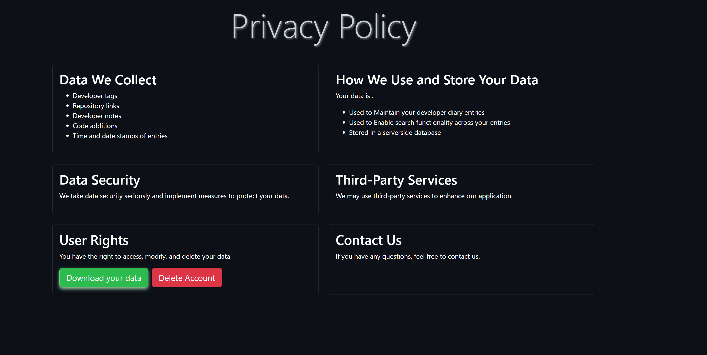

# Welcome to Dev Diaries Pilot Program

---

# How to test my site

- Type into the terminal: python main.py
- Open up a new terminal and type: python api.py
- Go to ports, observe the fowarded addresss, and copy it into the browser URL
- DO NOT USE THE SIMPLE BROWSER IN THE CODESPACE

# How to use the site

To use the site and bypass 2FA, you can use the credentials

- Username: AdminUser
- Password: P@ssword123
- Skip to index page instructions

However I strongly recommend you try signing up and testing the 2FA feature

- A strong password suggestion that passes all the requirements is P@ssword123

---

# 2FA Page

Once You successfully create an account, you will be redirected to the 2FA page

- Get the Google Authenticator App and scan the QR code, do not delete the code off the phone, as you will need it to log back in (it changes every few seconds)

---

# The Home Page

- You are now redirected to the home page
- You will see a navbar at the top of the page, you can go to any of the pages
- The buttons provide a more accessibile way to create or find entries, or logout
- The home page has a list of the most recent entries, you can press go to entry to view the full entry (This is also available in the search page)

---

# The Privacy Page

- This page is the privacy policy of the website
- You can download or delete the data by pressing the buttons

