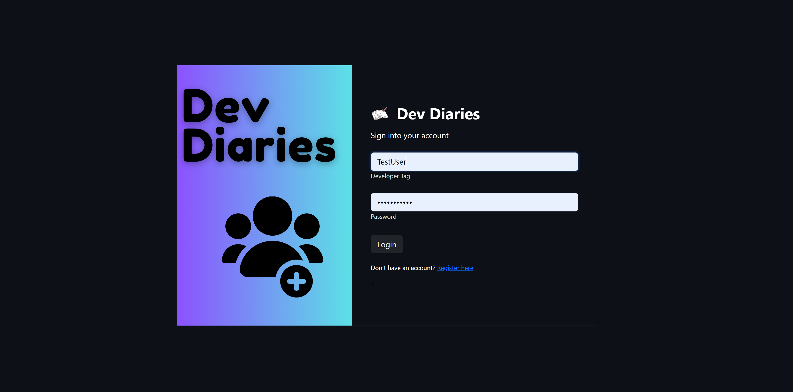
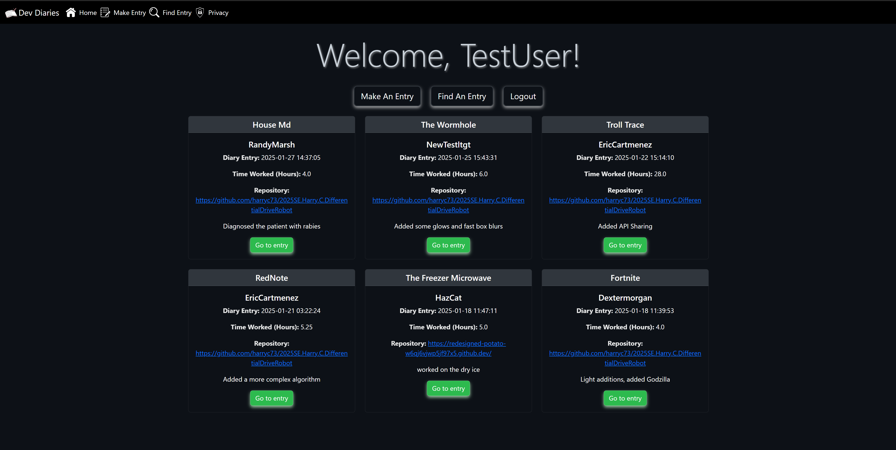
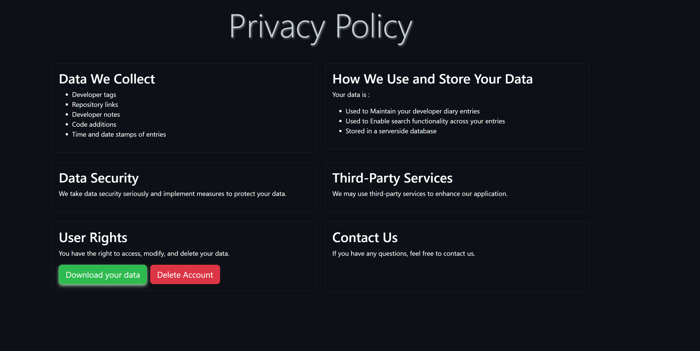

# Welcome to Dev Diaries Pilot Program

---

# How to test my site

- Type into the terminal: python main.py
- Open up a new terminal and type: python api.py
- Go to ports, observe the fowarded addresss, and copy it into the browser URL
- DO NOT USE THE SIMPLE BROWSER IN THE CODESPACE

# How to use the site

Use the following credentials to login:

- Username: TestUser
- Password: P@ssword123

Though I implore you to create your own account!

---

# 2FA Page

Open the Google Authenticator app on your phone and scan the QR code

---

# The Home Page

- You will see a navbar at the top of the page, you can go to any of the pages
- The buttons provide a more accessibile way to create or find entries, or logout
- The home page has a list of the most recent entries, you can press go to entry to view the full entry (This is also available in the search page)

---

# The Privacy Page

- This page is the privacy policy of the website
- You can download or delete the data by pressing the buttons
